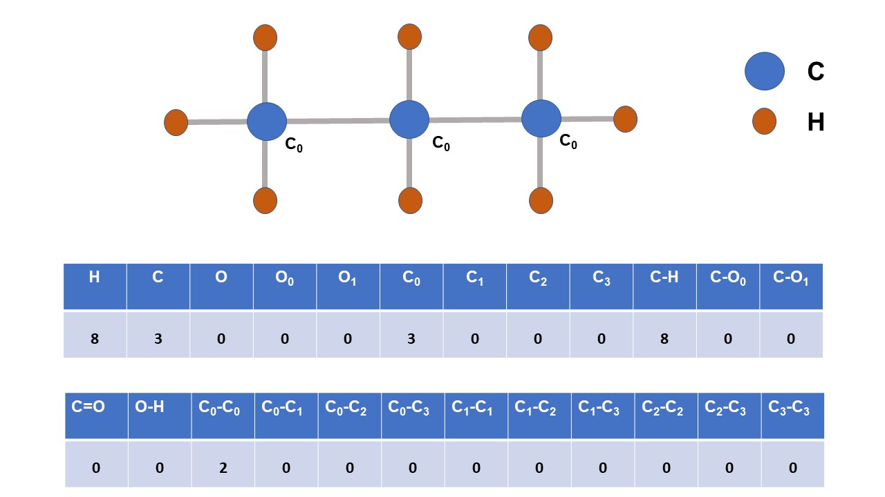
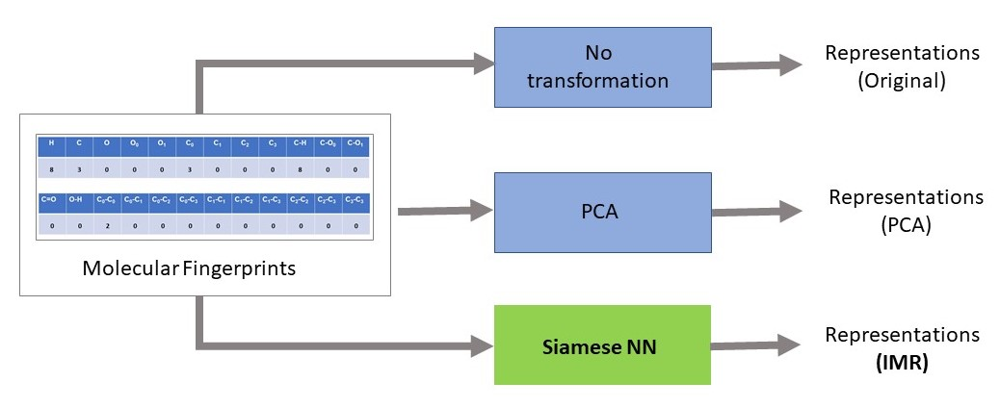
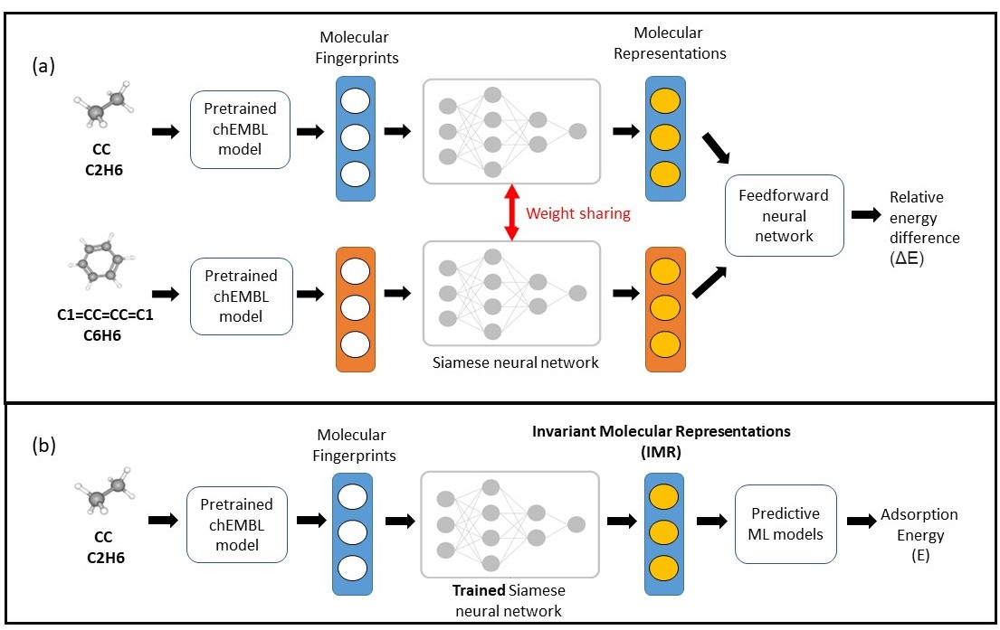
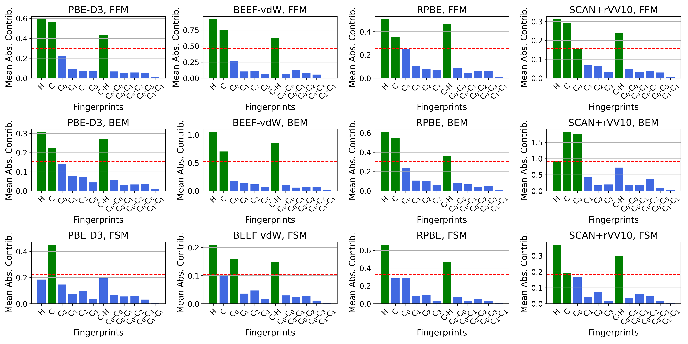
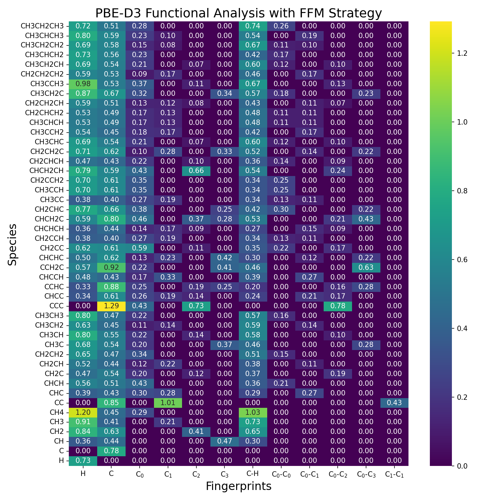
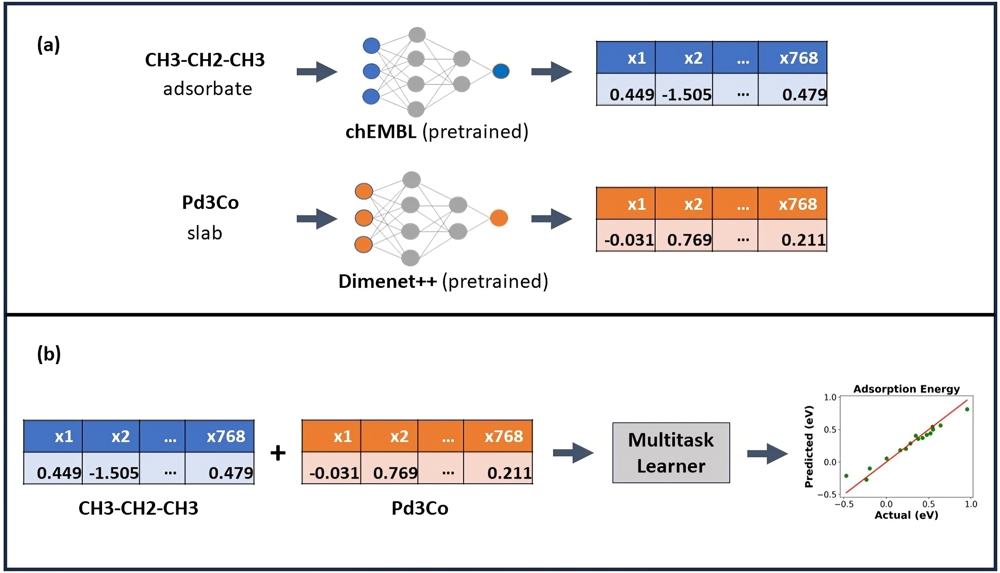
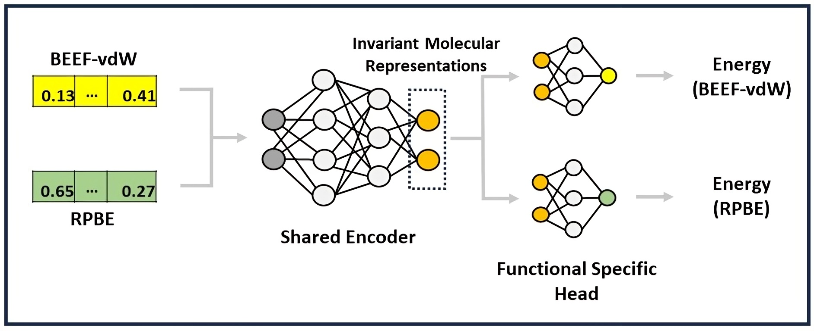

# Invariant Molecular Representations for Heterogeneous Catalysis

This project is associated with the paper titled **"Invariant Molecular Representations for Heterogeneous Catalysis"**, published in the **Journal of Chemical Information and Modeling**, Volume 64, Issue 2, January 22, 2024. You can read the full paper [here](https://pubs.acs.org/doi/epdf/10.1021/acs.jcim.3c00594).

## Key Contributions

1. Introduced a novel learning method for predicting adsorption energies of reaction intermediates by leveraging multiple density functional theory (DFT) functionals, overcoming the challenges posed by the idiosyncrasies of different functionals.
2. Demonstrated that incorporating additional functionals results in significantly improved invariant molecular representations (IMRs), leading to better prediction accuracy compared to traditional and PCA-based representations.
3. Extended the IMR method to accurately model interactions across multiple surface systems, enhancing the predictive capacity for large-scale datasets.

## Visualizations

1. **Generating Molecular Descriptors/Fingerprints**  
     
   This plot illustrates the process of generating numerical representations (molecular descriptors/fingerprints) from chemical structures.

2. **Types of Transformations for Molecular Representations**  
     
   This plot shows three different types of transformations for generating molecular representations from molecular fingerprints.

3. **Siamese Neural Network Model and Predictive Pipeline**  
     
   This plot illustrates the structure of the pair-based Siamese neural network model and the predictive modeling pipeline.

4. **Feature Contribution Analysis Across Training Strategies and DFT Functionals**  
     
   This plot shows the feature contribution analysis across different training strategies and DFT functionals.

5. **Feature Contribution Breakdown on Molecular Species**  
     
   This plot visualizes the feature contribution breakdown across different molecular species.

6. **Extended IMR Learning Strategy for Surface and Adsorbate Fingerprints**  
     
   This plot shows the updated IMR learning strategy and fingerprint generation for both slabs/surfaces and adsorbates.

7. **Invariance Using Multitask Learner Model**  
     
   This plot illustrates how the multitask learner model exploits invariant relationships based on available training functionals/data sources.

